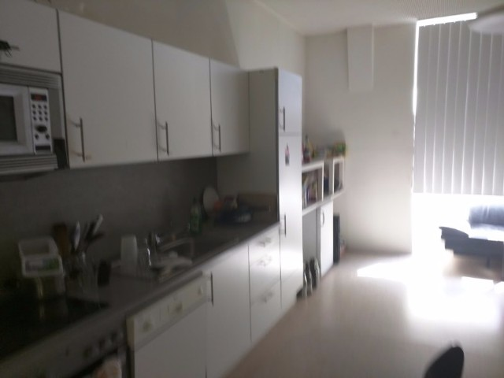

# Linz滞在レポート

記: 永松 歩

## INDEX
* Interface Culture
    * 生徒構成
    * 教員構成
    * 設備
* Austriaのアートシーン
    * Linz
    * Vienna
* 滞在中の制作
* Austria外の視察
    * Resonate 2017
    * Documenta 14
    * Berlin, Munich
* 所感

## Interface Culture

リンツ工芸大学（Kunstuniversitat Linz）内にある、インタラクティブ・アートをテーマにした英語プログラム。Master、PhDの学位取得が可能。教授の国際的なつながりのためか、生徒の国籍が非常に多様。

### 生徒構成
1学年が15名程度のMaster Course。PhDのために来ている方や研究員を若干名。国籍は非常に多様。年齢もレンジがある。論文を書いていない学生もいるし、2年以上在籍する学生が多い。授業や講評会などにおいて、議論はかなり活発で時にかなり白熱する。作品のレビューについても学生間の意見交換が活発。思想・政治についての問題は日本よりはるかに活発に議論している。
学生はおのおの制作を進めているが、やはりArs Electronicaのおかげでマイルストンが明確になり、それに向けて制作している。[Yen Zu Chang](https://www.aec.at/aeblog/en/2017/03/20/yen-tzu-chang/) , [Martin Nadal](http://spectrum.muimota.net/) などは多作でEurope内外で活動している。[Johannes Wernicke](http://cargocollective.com/johanneswernicke)は興味深い作品をどんどん発表している。

### 教員構成
常勤の教授はChrista, Lorrentのみ。招聘教授にMasaki Fujihataがおり、3名ながら世界的に活躍するトップアーティストが3名在籍していることになる。AssistantにMichaela, Fabrizio, 事務系にGertrude。講師はほとんどKunstuniの外部から来ている。少人数運営ながらInteractive Artの制作手法に関する授業が充実している。ChristaやLorrentはかなり忙しく（2017年の夏は筑波大にいるらしい）、学生の相談に乗っているわけではないが、レビューや相談の場を週次で持っている。

### 授業
Practiceよりの授業がほとんどであり、技法を習得する授業構成になっているが、その中で他のアート作品について言及があったり、リサーチを課題にしたりしている。Theory的な部分はChristaが体系的なInteractive Artの紹介をしているほか、授業以外のGuest Lectureがかなりたくさん用意され、同時代のart sceneを外観するには事欠かない。
[Animal music symposium](http://interface.ufg.at/animus/), [Poetics of Politics](https://supergraph.github.io/pop-2017/), [TNC17](http://tnc17.servus.at/), [Domenico Quaranta](http://domenicoquaranta.com/)の講演, Quadratureの講演, Bilbao art universityの学生など。
街全体でも、Film Festivalが開催されるなど、Art系のイベントにはこと欠かない。

主な授業は以下。詳しくは[こちら](http://www.ufg.ac.at/Courses.3001+M52087573ab0.0.html)
* Interactive Art
* Micro Controller
* Media Archeology
* Audio Visual
* Interface technology
* Game Programming
* Programming
* Labor IC
* Mobile Cinema

授業の様子は[自分のブログにも多少まとめた](http://ayumu-nagamatsu.com/archives/660/)。
また、Ars Electronicaに向けた出展作品のレビュー会も印象深かった。それぞれ出展作家がプレゼンをし、教員や生徒がフィードバックをする。成績評価の場ではないため、肯定的なコメントも否定的なコメントも両方あり、そのアドバイスを適応するかは作家次第である。

### 設備
* 工具類も作業場でほぼ無許可で一通り使える他、プロジェクタやケーブル類なども貸出をしている。
* 共有キッチンがInterface Culture用にあり、自炊しつつコミュニケーションを図れる。冷蔵庫、ポットなども使える。
* 校舎内に、Dokapiと呼ばれる食堂+テラスがあり、週に一度程度、[ÖH - Hochschüler innenschaft](https://www.facebook.com/oehKunstUniLinz/)とよばれる学生団体が運営し料理を出してくれる。また[5 uhr tee](https://www.facebook.com/events/1284752724907767/)という、招聘アーティストのゆるいトークイベントが稀に開催される。
* 図書館は別館にあるがネットから蔵書検索できる。Interface Culture内にもInteractive Artに特化した英語文献の書棚がおいてあり、Gertrudeに申請して借りることができる。

## Austriaのアートシーン
### Linz
リンツでも半径数百メートル以内に美術館が点在している。Ars Electornica CenterとLENTOS museumが質・規模的にも目玉。

Ars Electornica CenterはFestival期間外でも常設展示をしている。Art-Comの作品などメディア・アートの展示も多いが、科学館のような科学を理解するためのコンテンツやデジタルマテリアルといった研究成果の展示も多い。Fab-Lab, Bio-Labのような小部屋があり、子供向けのイベントなども多数。Deep Space 8Kでは壁面、床面に贅沢にプロジェクションしつつ3Dグラスをつけて楽しめる。

LENTOS museumはメディア・アート以前のコンテンポラリーアートを収蔵し、キュレーションの優れた企画展を行っている。私が訪れたときは精神科の医師の視点からアール・ブリュットの作品を紹介する企画展が行われていた。常設においても、アーティストが各部屋をキュレーションし自分の作品との関連作品を論じる企画などが目を引いた。Sol LeWittやKarl-Heinz Adlerといったバウハウスの影響を感じさせるジオメトリックな作風の画家のコレクションも豊富。

Mauthausennはリンツ近郊にある強制収容所跡地である。ナチスの政敵やユダヤ人が大量に殺害された場所であるが、その労働内容は花崗岩の採掘であり、それは製鉄に利用された。今なお鉄工業で栄えている工業都市である。リンツはヒトラーの生まれ故郷であり思い入れを抱いたことがその地に暗い影を落としている。

Ars Electronica Center / Lentos Museum / Mauthausen / OK Center / Tabakfabrik / Schloss Museum / Landesgalarie / Nordico Stadt

### Vienna
ウィーンの美術館は、モダニズム以前のアートの展示がほとんどであり、とりわけKlimtやSchieleといった画家が目玉とされていた。Schönbrunn PalaceやKonzerthausでの華麗な古典音楽というような富裕層向けの文化が一般的なイメージとしてあるが、絵画においては、エロスとタナトスを主題とした重たいイメージが国民的なアイデンティティとして打ち出されているのは興味深い。

ウィーンアクショニズムという歴史上最も過激な芸術運動についても[MUMOK](https://www.mumok.at/en)にて収蔵・展示しているのも意外性を感じざるを得ない。同施設では、Feminism Avant Gerdeという企画展が催されていた。[美術史美術館](https://www.khm.at/en/)は、西欧の美術館らしいギリシア美術からエジプト美術まで揃えるほか、ハプスブルク家にまつわる金銀細工といった宝物のコレクションが興味を引いた。[Albertina](http://www.albertina.at/en/)は想像に反して非常にセンスの良い近現代の絵画コレクションを持っていた。Bacon, Kandinsky, Picasoなど20世紀の巨匠に加え、Eeuard Angeli, Maria Lassigといった同時代の作家を紹介している。

Secession / Albertina / Belvedere / mumok / Leopold museum / Kunsthistoriche museum

## 滞在中の制作
* Leaves
    * 藤幡先生に何かしらの展示をしたい旨を相談
    * -> Ars Electronica に Proposal提出
    * -> 審査通過（レビューではひたすらにモチーフや選んだ支持体の意味をとわれる）
    * -> Ars展示期間（9月中旬）がIAMAS予備審査1にどんかぶりするも、教員の神対応によりリンツにて中継審査するで対応いただけることに決定
    * -> そもそも6月末の中間発表も帰宅が間に合わなかったため、藤幡先生の部屋で設営し学内展示期間に中継（これもまた教員陣に神対応に頂いた。）
* ofxDeferredShading
    * 陰影をつけるopenFrameworksのAddon。Resonate2017でのCGアーティストに触発
    * スクリーン空間での法線/色/位置情報のBuffering、数種の陰影計算の適応
* Daily Sketch
    * 造形スキルを日頃から高める
    * Hoodiniなどで流行っているプロシージャルモデリングをoFでやる
    * 3Dの複雑かつ調和のとれた図像のスタディ

## その他の視察
### Resonate 2017
Belgradで毎年おこなわれるデジタル・アートのフェスティバル。Memo Akten, Evan Bohem, Daito ManabeといったArtistsが過去参加しており、今年はMarpi, Gene Kogan, Marius Watz, AGF, Yoichiro Ushigomeなどが参加。主にレクチャー、ワークショップがメインだが展示やパフォーマンス上演も多数。自分はMarpiのWS, Gene Kogan, Marius Watzのレクチャーなどに参加。

### Documenta 14
Kasselで行われる現代アートの祭典で今回は5年ぶりの14回目。今年はAtheneと二拠点開催。Venice Bienaleとは対照的で、社会のマイノリティやフォーカスしたり、アート大国の作家を意図的に絞ったりしている。サウンド・アートやパフォーマンスなども多かった。

### Berlin, Munich Museum
* Bauhaus Archive: バウハウスコレクション。イッテンのドローイング
* Martin-Gropius Bau: 写真とかルター派とか
* Topography of Terror: 秘密警察跡地
* Jewish Museum: ユダヤ史。Daniel Libeskindの建築。
* Museumsinsel
    * Neue Museum: エジプト、博物
    * Altes Museum: ギリシャ・ローマ美術、中世美術
    * Alte National Gallerie: ロマン主義（C.D.Friedrich、Friedrich Shinckelなど）
    * Baude Museum: 彫刻コレクション
    * Hamburger Banhof: Dan Flavin, Joseph Beuysなど
* Museum Berggruen: クレー、シャガール、ピカソ
* Sammlung Scharf-Gerstenberg: エルンスト、ルドン、クビン、ベルマン
* Altes Ponakothek
* Nues Pinakothek
* Pinakothek der Moderne

## 所感
* アートに関する社会基盤は欧州は圧倒的に充実している
    * この点については[別途まとめた](http://ayumu-nagamatsu.com/archives/672/)。
* English communicationの重要性
* すると良いと思うこと
    * 展示、制作を通した交流
    * Artistと話す
    * 次につながること（支援者やResidenceのリサーチや訪問）
